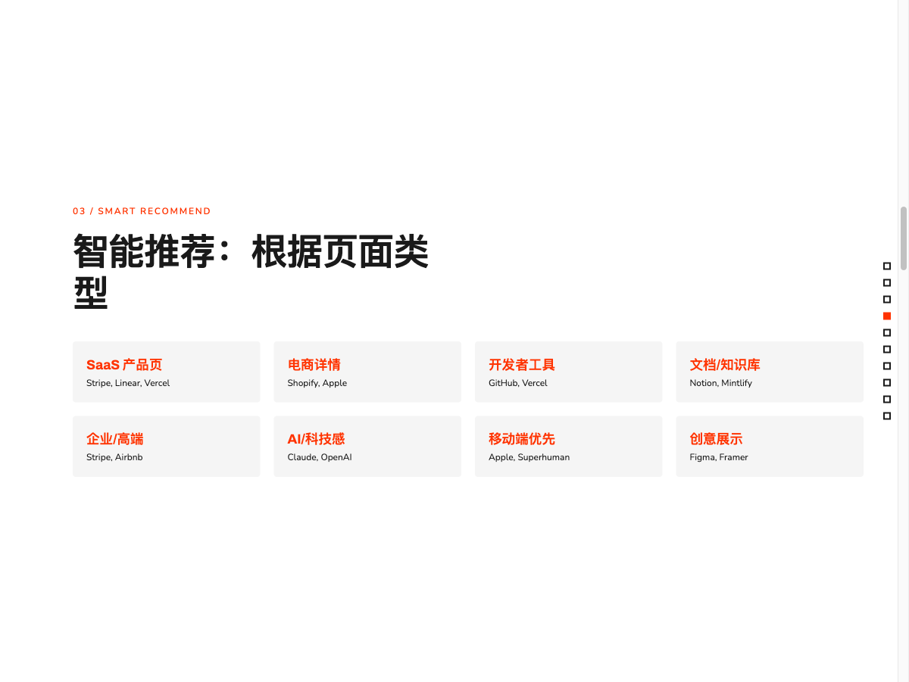
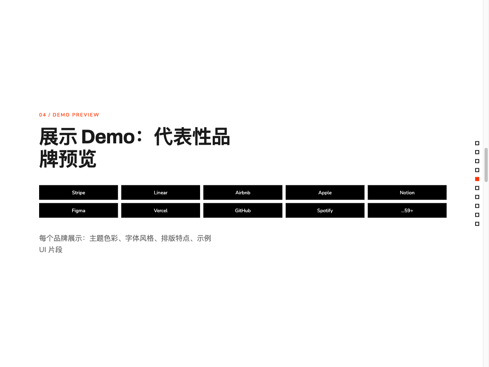
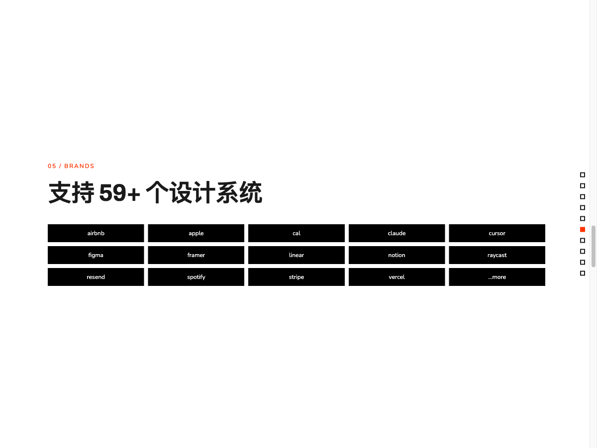
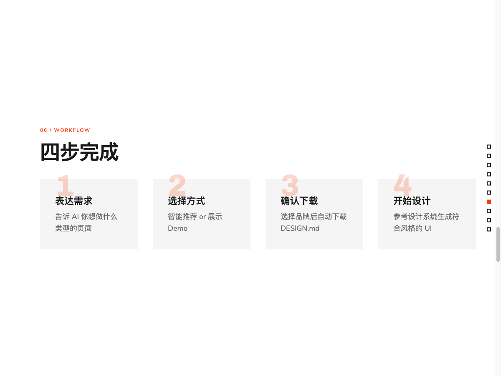
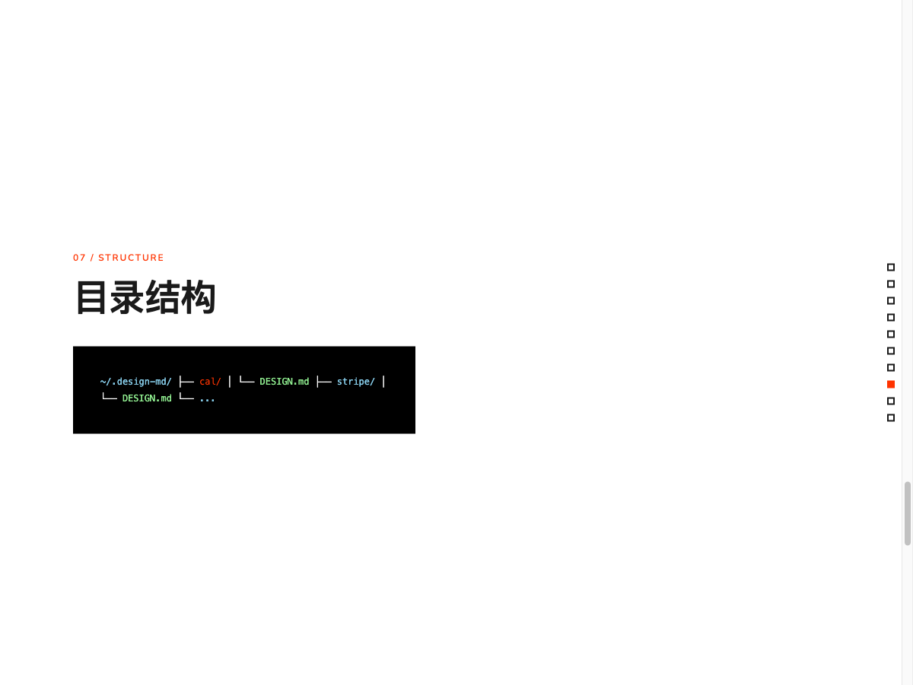
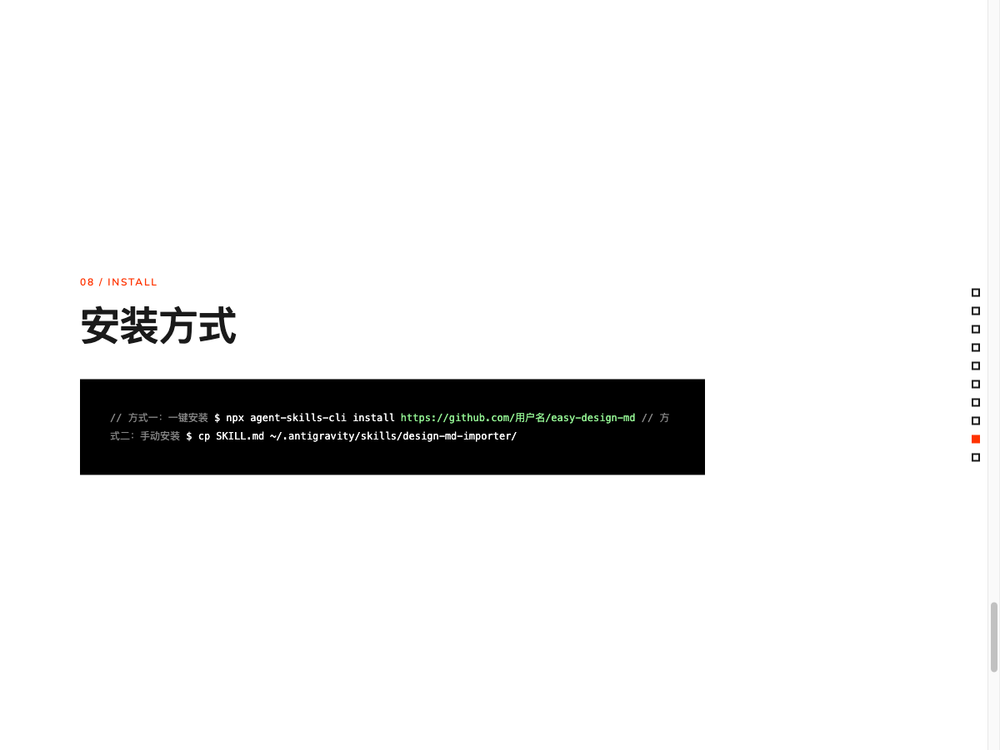
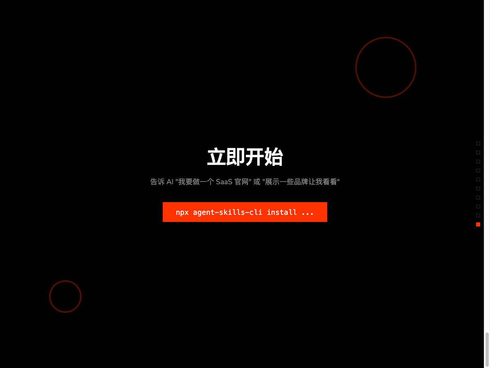

# Easy Design MD

让 AI 帮你选择最合适的设计系统，一键下载 DESIGN.md 文件。

## 幻灯片演示










## 功能特点

### 双轨选择流程

当你想要模仿某个品牌的设计时，不知道该选哪个品牌？

**选项 A: 智能推荐**
- 告诉 AI 你想做什么类型的页面（SaaS、电商、文档等）
- AI 根据页面类型推荐最合适的设计系统

**选项 B: 展示 Demo**
- AI 展示多个代表性品牌的视觉预览
- 你看后选择想要的风格

### 智能推荐分类

| 页面类型 | 推荐品牌 |
|---------|---------|
| SaaS 产品页 | Stripe, Linear, Vercel |
| 电商详情 | Shopify, Apple |
| 开发者工具 | GitHub, Vercel |
| 文档/知识库 | Notion, Mintlify |
| 企业/高端 | Stripe, Airbnb |
| AI/科技感 | Claude, OpenAI |
| 移动端优先 | Apple, Superhuman |
| 创意展示 | Figma, Framer |

### 支持 59+ 个设计系统

Stripe, Linear, Airbnb, Apple, Notion, Figma, Vercel, GitHub, Spotify, Cal.com, Claude, Cursor, Framer, Mistral, MongoDB, Notion, NVIDIA, OpenAI, Pinterest, PostHog, Raycast, Replicate, Resend, Runway, Sanity, Sentry, Spotify, Stripe, Supabase, Superhuman, Tesla, Together.ai, Uber, Vercel, Zapier 等。

## 安装方式

### 方式一：一键安装（推荐）

```bash
npx agent-skills-cli install https://github.com/maxliux5/easy-design-md
```

### 方式二：手动安装

```bash
# 安装到 ~/.antigravity/skills/easy-design-md/
cp -r skills/easy-design-md ~/.antigravity/skills/
```

## 使用方法

安装后，只需告诉 AI 你的需求：

```
用户: "我想做一个 SaaS 产品的官网"
AI: "SaaS 官网的话，我推荐 Stripe 或 Linear。Stripe 的设计干净专业，Linear 深色系更酷炫。你更喜欢哪个？"

用户: "展示一些品牌让我看看"
AI: "好的，这里有几个代表性品牌的预览..."
```

AI 会引导你完成选择，然后自动下载 DESIGN.md 文件到 `~/.design-md/{brand}/` 目录。

## 目录结构

```
~/.design-md/
├── cal/
│   └── DESIGN.md
├── stripe/
│   └── DESIGN.md
├── linear/
│   └── DESIGN.md
└── ...
```

## 工作流程

1. **表达需求** - 告诉 AI 你想做什么类型的页面
2. **选择方式** - 智能推荐或展示 Demo
3. **确认下载** - 选择品牌后自动下载 DESIGN.md
4. **开始设计** - 参考设计系统生成符合风格的 UI

## 技术栈

- Claude Code Skill
- [getdesign.md](https://getdesign.md) 设计系统下载服务
